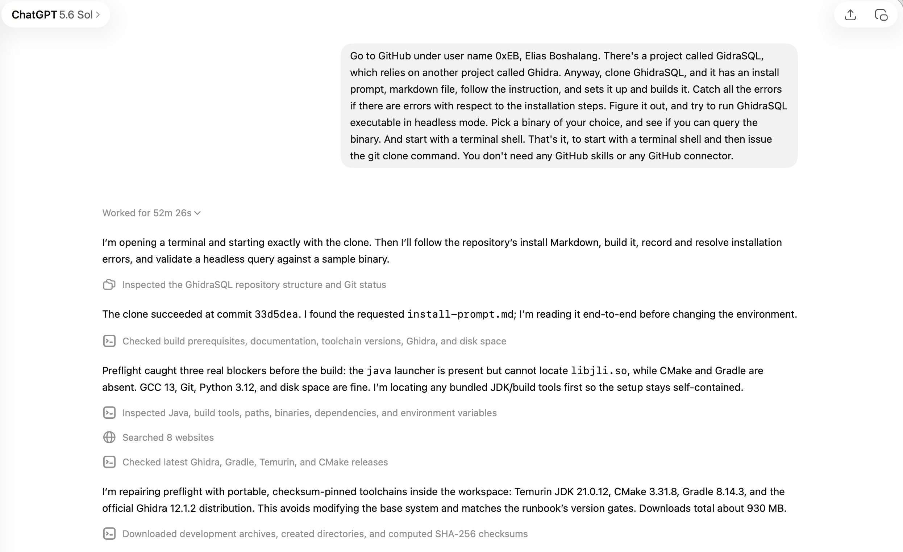
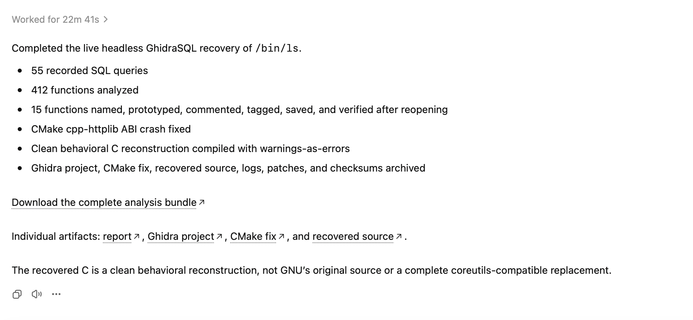

# What ChatGPT Work Can Really Do: Reverse Engineering a Binary From My Phone, On a Walk

*By **Elias Bachaalany** — [@0xeb](https://github.com/0xeb) on GitHub · [Binary Wizards](https://www.youtube.com/@binary-wizards) on YouTube · [@eliasbchlny](https://x.com/eliasbchlny) on X*

*I left the house for a walk. I dictated one paragraph into my phone. Seventy-five minutes later I had a fully analyzed Ghidra project, fifteen recovered function names and prototypes, a patch for a real bug in my own code, and a compiling C reconstruction of a stripped binary — in a zip file, waiting for me.*

---

## The part nobody tells you: it's a VM

ChatGPT Work is the successor to Agent mode — the thing you used to trigger by typing `@Agent`. The rename made it sound like a productivity feature. It isn't. **When you're in ChatGPT Work in the mobile app, you have a Linux VM.**

That is the whole story. Not a sandbox that draws a chart and forgets it — a real machine with a shell, a persistent filesystem, network access, compilers, and 50+ GB of disk. Once you internalize that, your prompts change shape. You stop asking for explanations and start asking for *work*:

> Clone this repo. Read its install docs. Build it. It'll break — figure out why and fix it. Then actually run it against something real.

And because it's a VM with a filesystem, there's a natural ending to every session: **ask for a zip.** Everything the machine produced comes back to you as a download, ready to open on your desktop. Clone → build → experiment → zip. That loop fits in a walk.

I documented what's inside that machine separately — CPU, RAM, disk, toolchains, and everything the sandbox refuses to show you — in [**Full system inventory of the ChatGPT Work VM**](../chatgpt-sandbox/chatgpt-work-vm-env-08062026.md). This article is what happens when you *use* it.

## The ask

I wanted to see it do something genuinely hard. Not "write me a script" hard — *reverse engineering* hard.

I have a project called [**GhidraSQL**](https://github.com/0xeb/ghidrasql): an agentic connector that exposes [Ghidra](https://ghidra-sre.org/), the NSA's software reverse engineering suite, as a SQL interface. The binary becomes a database you can `SELECT`, `UPDATE`, and `JOIN` — functions, call graph, strings, and decompiled pseudocode all queryable, findings written straight back into the project. It's one of the [xSQL family of tools I presented at REcon 2026](https://github.com/0xeb/presentations/tree/main/select_from_binary_vibe_re), and it's built for exactly this kind of agent-driven analysis — but it needs Ghidra, a JDK, Gradle, and CMake to even start.

So I dictated this into my phone (note the typos in the transcription) and kept walking:

> Go to GitHub under user name 0xEB, Elias Bachaalany. There's a project called GhidraSQL, which relies on another project called Ghidra. Anyway, clone GhidraSQL, and it has an install prompt, markdown file, follow the instruction, and sets it up and builds it. Catch all the errors if there are errors with respect to the installation steps. Figure it out, and try to run GhidraSQL executable in headless mode. Pick a binary of your choice, and see if you can query the binary. And start with a terminal shell. That's it, to start with a terminal shell and then issue the git clone command. You don't need any GitHub skills or any GitHub connector.



*The prompt as dictated on a walk. "GidraSQL" in the screenshot is a voice-transcription artifact, corrected above.*

Note what that prompt does and doesn't do. It doesn't specify a binary — I said **"pick a binary of your choice."** It doesn't tell it how to fix anything. It explicitly forbids the shortcut ("you don't need any GitHub skills or any GitHub connector") because I wanted to see plain `git` in a plain shell. And it pre-authorizes the hard part: *catch all the errors, figure it out.*

Then I put the phone in my pocket.

## 52 minutes, unattended

It opened a terminal, cloned at commit `33d5dea`, and read the repo's `install-prompt.md` end to end **before touching the environment**. Then preflight:

> Preflight caught three real blockers before the build: the `java` launcher is present but cannot locate `libjli.so`, while CMake and Gradle are absent. GCC 13, Git, Python 3.12, and disk space are fine.

Every one of those is confirmed in the [environment inventory](../chatgpt-sandbox/chatgpt-work-vm-env-08062026.md): Java ships as a launcher with a missing runtime library, and CMake and Gradle simply aren't installed. A less careful agent would have run `cmake` and face-planted. This one checked first, then went shopping:

> I'm repairing preflight with portable, checksum-pinned toolchains inside the workspace: Temurin JDK 21.0.12, CMake 3.31.8, Gradle 8.14.3, and the official Ghidra 12.1.2 distribution. This avoids modifying the base system and matches the runbook's version gates. Downloads total about 930 MB.

**Checksum-pinned. Workspace-local. Version-gated against my own runbook.** It searched 8 websites to confirm current release versions first. That is what a competent engineer does on an unfamiliar box, and it did it while I was looking at trees.

## The walls — and how it got over them

This is my favorite part of the whole run, and it's the part that proves nobody scripted this in advance. Eight distinct failures, each diagnosed and fixed. Straight from [`report.md`](./report.md):

| Stage | Observed failure | Cause | Resolution |
|---|---|---|---|
| Toolchain discovery | Required JDK 21, modern CMake, and Gradle were absent or unusable from the system path | Host tools did not satisfy the install prompt | Installed workspace-local OpenJDK 21.0.12, CMake 3.31.8, Gradle 8.14.3 |
| Java loader | `libjli.so: cannot open shared object file` | The relocatable JDK's private libraries were not on the loader path | Supplied the JDK `lib` and `lib/server` directories through `LD_LIBRARY_PATH` |
| Temporary files | Java/native steps could not rely on a normal `/tmp` | The runtime had no usable conventional temporary directory | Used workspace `.tmp` through `TMPDIR` and `-Djava.io.tmpdir` |
| Dependency transport | HTTPS dependency resolution/downloads failed or were interrupted | Restricted/proxied transport; Java trust did not initially match | Used Git transport, resumable downloads, and a workspace-local Java trust setup |
| Parallel native build | The assembler received truncated input during a concurrent build | Resource pressure interrupted a compiler process, leaving an incomplete assembly stream | Removed only the failed target output and rebuilt serially |
| Ghidra launch | `support/launch.sh` failed where Bash process substitution required `/dev/fd` | `/dev/fd` was unavailable in the runtime | Rewrote the process-substitution loops as here-strings |
| First managed GhidraSQL run | glibc aborted in `pthread_mutex_lock` | Two cpp-httplib revisions with different feature macros linked into one executable — incompatible inline class layouts | Forced a single shared cpp-httplib source and linked it publicly |
| First strict source build | Fallthrough and "control reaches end" diagnostics became errors | The compiler didn't know `usage()` and the OOM handler never return | Marked both `_Noreturn`; final strict build is clean |

Look at row six. Ghidra's own launcher uses Bash process substitution — `done < <(command)` — which needs `/dev/fd`. The VM doesn't have it. The fix is twelve lines:

```diff
 while IFS=$'\r\n' read -r line; do
+	[ -z "$line" ] && continue
 	IFS='=' read -r key value <<< "$line"
 	if [ -z ${!key} ]; then
 		export $key=$value
 	fi
-done < <("${JAVA_CMD}" -cp "${LS_CPATH}" LaunchSupport "${INSTALL_DIR}" -envvars)
+done <<< "$("${JAVA_CMD}" -cp "${LS_CPATH}" LaunchSupport "${INSTALL_DIR}" -envvars)"
```

Same semantics, no `/dev/fd`, plus a guard for the empty line that the here-string form introduces. That's not pattern-matching a Stack Overflow answer; that's understanding why the construct failed.

And row seven is the one that made me sit up. The managed server crashed inside `pthread_mutex_lock` — the kind of bug that eats an afternoon. It correctly identified an **ODR/ABI mismatch**: two different revisions of the header-only `cpp-httplib` were being pulled into one executable with different OpenSSL/zlib feature macros, so the inline class layouts disagreed and the server object's synchronization state was corrupted. It wrote the CMake fix, rebuilt, and the server came up.

That's a real bug in *my* project, found by an agent on my phone, with a correct diagnosis and a working patch. I'm keeping that fix (and its explanation) for GhidraSQL upstream rather than reprinting it here — but it's the strongest single result of the run.

## The actual reverse engineering

With GhidraSQL alive, it picked its own target: the system `/bin/ls`. A stripped x86-64 PIE ELF, GNU coreutils 9.4.

**The choice of binary barely matters.** It could have been a malware sample, a firmware blob, or a vendor library — the workflow is identical. `ls` is a good demo precisely because you can check the answer: everyone knows what `ls` is supposed to do, so a reconstruction either behaves like `ls` or it doesn't.

The first query sets the scene:

```sql
SELECT * FROM binary;
SELECT COUNT(*) AS funcs, SUM(size) AS total_bytes FROM funcs;
SELECT COUNT(*) AS edges FROM callgraph_edges;
SELECT COUNT(*) AS string_hits FROM string_refs;
```

**412 functions. 79,542 bytes of function body. 1,363 call graph edges. 259 string references.** Stripped, so every one of those functions is named `FUN_00104da0` and typed `undefined`.

Finding `main` in a stripped PIE binary is the classic first move, and it did it the classic way — one query:

```sql
SELECT text FROM pseudocode WHERE func_addr = 0x106D30;
```

```c
void processEntry entry(undefined8 param_1, undefined8 param_2)
{
  undefined1 auStack_8 [8];
  __libc_start_main(FUN_00104da0, param_2, &stack0x00000008, 0, 0, param_1, auStack_8);
  do { /* WARNING: Do nothing block with infinite loop */ } while( true );
}
```

The first argument to `__libc_start_main` **is** `main`. There it is: `0x104DA0`. From there it worked outward through the call graph, string evidence, and scoped decompilation — 8,029 bytes of `main`, 72 distinct callees, GNU help text and embedded `src/ls.c` assertion strings as corroboration.

Then it started writing findings back. Each annotation is one transaction that reads the function, tags it, renames it, sets a prototype, attaches a plate comment, reads it back to verify, and saves:

```sql
SELECT addr,name,prototype FROM funcs WHERE addr=0x107D70;
INSERT OR IGNORE INTO function_tag_mappings(func_addr,tag_name) VALUES(0x107D70,'progress:seed');
UPDATE funcs SET name='ascii_strncasecmp',
  prototype='int ascii_strncasecmp(char *left, char *right, long length)' WHERE addr=0x107D70;
INSERT INTO comments(addr,comment,source)
  VALUES(0x107D70,'Compare at most length ASCII bytes case-insensitively; locale-independent helper.','plate');
INSERT OR IGNORE INTO function_tag_mappings(func_addr,tag_name)
  VALUES(0x107D70,'progress:reviewed'),(0x107D70,'progress:annotated');
SELECT addr,name,prototype FROM funcs WHERE addr=0x107D70;
SELECT save_database();
```

Read → write → read-back → save. Fifteen times. The discipline was deliberate and recorded: keep decompiler queries scoped to one function, serialize decompiler work, establish names from multiple evidence sources before writing, verify every mutation, save after coherent groups.

Here's what came out:

| Address | Recovered name | Prototype | Role |
|---|---|---|---|
| `0x104DA0` | `main` | `int main(int argc, char **argv)` | Initialize state, parse options, gather/sort/print operands, drain the directory queue |
| `0x106EA0` | `get_funky_string` | `bool get_funky_string(char **dest, char **src, int equals_end, long *length)` | Decode `LS_COLORS` escape syntax |
| `0x107D70` | `ascii_strncasecmp` | `int ascii_strncasecmp(char *left, char *right, long length)` | Locale-independent bounded ASCII comparison |
| `0x1090E0` | `usage` | `void usage(int status)` | Print usage/help and exit |
| `0x109EE0` | `stdout_isatty` | `bool stdout_isatty(void)` | Cache and return stdout terminal state |
| `0x109F10` | `clear_files` | `void clear_files(void)` | Free accumulated file records, reset per-listing state |
| `0x10B910` | `required_statx_mask` | `uint required_statx_mask(void)` | Build the metadata mask required by active options |
| `0x10BBB0` | `color_indicator_is_nonempty` | `bool color_indicator_is_nonempty(uint indicator)` | Test whether a selected color indicator has content |
| `0x10BD80` | `get_type_indicator` | `char get_type_indicator(char stat_ok, uint mode, int filetype)` | Return the classification suffix for a file type |
| `0x10E4B0` | `sort_files` | `void sort_files(void)` | Sort the file-pointer array using active options |
| `0x1105F0` | `print_current_files` | `void print_current_files(void)` | Render the current vector in the selected layout |
| `0x110B80` | `queue_directory` | `void queue_directory(char *name, char *realname, bool command_line_arg)` | Prepend a deferred directory traversal record |
| `0x110C00` | `extract_dirs_from_files` | `void extract_dirs_from_files(char *dirname, bool command_line_arg)` | Move directories from the file vector to the traversal queue |
| `0x110FD0` | `print_dir` | `void print_dir(char *name, char *realname, bool command_line_arg)` | Enumerate, gather, sort, print, recurse |
| `0x1174A0` | `gobble_file` | `ulong gobble_file(char *name, uint filetype, bool command_line_arg, char *dirname)` | Gather one file record and its requested metadata |

Anyone who has read coreutils will recognize those names. They weren't looked up — they were *derived*, then independently corroborated by the embedded assertion strings.

## Proving it stuck

Naming functions in a decompiler is easy. Making the work **persist** is where headless automation usually falls apart. So it tested itself: final `save_database()`, clean shutdown, then reopen the same project **read-only** and ask whether anything survived.

```sql
SELECT program_revision() AS reopened_revision;
SELECT f.name, printf('0x%X',f.addr) AS addr, f.prototype, c.comment
  FROM funcs f JOIN comments c ON c.addr=f.addr
  WHERE f.addr IN (0x104DA0,0x106EA0,0x107D70, /* …all 15… */ 0x1174A0)
  ORDER BY f.addr;
SELECT COUNT(DISTINCT func_addr) AS persisted_annotations
  FROM function_tag_mappings WHERE tag_name='progress:annotated';
```

All fifteen came back, prototypes and plate comments intact:

> `main` · `0x104DA0` · `int main(int argc, char **argv)` · *"Initialize locale and global listing defaults; parse short/long options and environment; configure quoting, color, time, and layout; gather command-line operands; sort/print files; then drain the directory traversal queue."*

`readonly server exit=0`. The live database had reached program revision 316 before its final save.

## The payoff: it compiles, and it's right

From the recovered architecture it wrote a C reconstruction — [`recovered_ls.c`](./recovered_ls.c), ~28 KB — preserving the six-stage structure it had recovered: parse options → gather into a file vector → sort → render → extract directories into a deferred queue → enumerate and recurse.

It builds clean under warnings-as-errors:

```
cc -O2 -std=c11 -Wall -Wextra -Wpedantic -Werror -o recovered-ls recovered_ls.c
```

No `FUN_`, no `DAT_`, no `LAB_`, no `undefined8`, no decompiler warning comments. Then the test that actually matters — run the real `ls` and the reconstruction over the same directory and diff:

```
$ /bin/ls -1A --color=never        $ ./recovered-ls -1A --color=never
Makefile                            Makefile
README.md                           README.md
recovered-ls                        recovered-ls
recovered_ls.c                      recovered_ls.c
```

The diff **is empty.** Identical names, identical order.

And it checksummed everything it produced — 26 files, `sha256sum -c` clean, plus a `cmp` proving the analyzed binary matched the system one byte for byte.



*The end of the session: every artifact offered as a download. This is the "ask for a zip" ending that makes the whole loop portable.*

## What this is not

The reconstruction is a **behavioral** one, not GNU's source, and it doesn't pretend otherwise. It deliberately leaves out full quoting styles, complete `LS_COLORS` handling, ACL/SELinux columns, dired offsets, hyperlinks, locale-aware display widths, version sorting, and most long-option aliases. Each of those would need substantially more type, global, and library recovery.

The raw Ghidra pseudocode stayed in the query transcript; the reconstruction itself contains none of it. It's shipped under GPLv3 to match the analyzed original.

Provenance was recorded rather than asserted: GhidraSQL at `33d5dea`, libghidra at `0afcaa3`, ghidrasql-skills at `73a3275`, all v0.0.3, all cloned with plain `git` — **no GitHub connector, no GitHub-specific skill**, exactly as I asked.

## Do this yourself

The pattern is simple enough to dictate while walking:

1. **Start with the shell.** "Start with a terminal shell, then `git clone` …" — it grounds everything that follows in a real machine.
2. **Point at docs, not steps.** "It has an install markdown, follow it." Let it read the runbook.
3. **Pre-authorize the mess.** "Catch all the errors. Figure it out." Without this it asks permission and stalls; with it, it debugs.
4. **Leave room for judgment.** "Pick a binary of your choice." Constraints you don't need are just opportunities for it to guess wrong.
5. **Ask for the zip.** Everything it built comes home with you.

Total wall time: **52m 26s** to get from `git clone` to a working headless GhidraSQL, **22m 41s** for the recovery itself. I was not at a computer for any of it.

That's the thing worth sitting with. The bottleneck in this session wasn't the model's reasoning — it was 930 MB of downloads and a serial rebuild. The reverse engineering was the easy part. And the whole thing ran on a machine I'll never see again, kicked off from a phone, on a walk.

---

**In this folder:** [`report.md`](./report.md), the agent's own write-up — findings, workflow, every failure and fix, and the reconstruction's limits — plus [`recovered_ls.c`](./recovered_ls.c) and a `Makefile`. Build it with `make`, then try `./recovered-ls -la .`.

The analyzed binary is not redistributed; it was the stock `/bin/ls` from the VM, SHA-256 `0148f5ab3062a905281d8deb9645363da5131011c9e7b6dcaa38b504e41b68ea`.

**See also:** [Full system inventory of the ChatGPT Work VM](../chatgpt-sandbox/chatgpt-work-vm-env-08062026.md) — what's actually inside the machine · [GhidraSQL](https://github.com/0xeb/ghidrasql) — the SQL interface to Ghidra used here.
